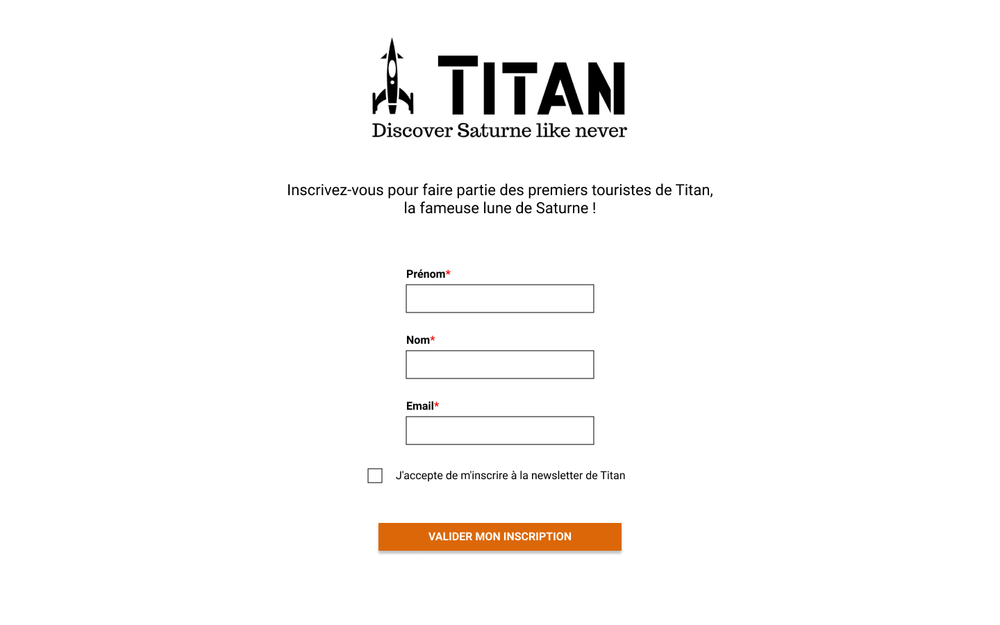
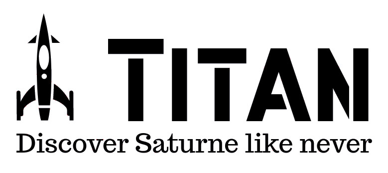

# Test webdev junior Adimeo
## Instructions

Merci de prendre le temps de faire ce test. Nous espérons que vous y prendrez du plaisir. Des commentaires sur vos choix ou vos difficultés sont attendus en accompagnement de votre rendu.

**L'objectif est de développer, à l'aide de PHP/MySQL/HTML/CSS, la maquette suivante :**

[https://www.figma.com/file/c9AhyfevRefiBbOvDaw605/Test-coding-pool?node-id=4%3A28](https://www.figma.com/file/c9AhyfevRefiBbOvDaw605/Test-coding-pool?node-id=4%3A28)

Il s'agit d'un formulaire dont il faut assurer la **validation en PHP**, ainsi que l'**enregistrement des données** en base de données **MySQL**.
La structure **HTML** doit être **sémantique** et l'**intégration CSS** conforme à la maquette fournie.

### Maquette
[https://www.figma.com/file/c9AhyfevRefiBbOvDaw605/Test-coding-pool?node-id=4%3A28](https://www.figma.com/file/c9AhyfevRefiBbOvDaw605/Test-coding-pool?node-id=4%3A28)
Le lien ci-dessus permet d'inspecter la maquette, et donc d'obtenir les tailles/mesures des différents éléments. Pour ceci il faut un compte Figma. Si vous ne voulez pas en créer un, la maquette est présente au format JPG dans ce dossier (maquette.jpg). Merci de signaler dans vos commentaire si jamais vous avez fait l'intégration seulement à partir du JPG.

### Librairies & outils
Vous êtes libre d'utiliser les outils avec lesquels vous êtes à l'aise (librairies, task runner, bundler, preprocesseur css, etc.) mais il est attendu que vous les listiez et en faisiez une présentation, à minima, de quelques mots.

### Font Roboto et logo
La font Roboto est la seule utilisée dans la maquette. Vous pouvez utiliser les fichiers présents dans le dossier "font Roboto" ou l'inclure d'une toute autre manière.
Le seul asset est le logo en haut de la maquette qui est présent dans ce dossier "logo.jpg"

## Rendu
* Votre rendu sera à envoyer par mail (lien de téléchargement ou archive)
* Votre rendu devra comporter des instructions d'installation (création de la DB notamment)
* Votre rendu devra comporter vos commentaires dans un fichier séparé, avec vos impressions, difficultés, outils utilisés, etc. **Ainsi que le temps que vous avez passé sur ce test.**
* En fonction du temps que vous avez à y consacrer vous pouvez bien sur en profiter pour proposer des choses en plus (responsive, validation JS du formulaire, etc.)
